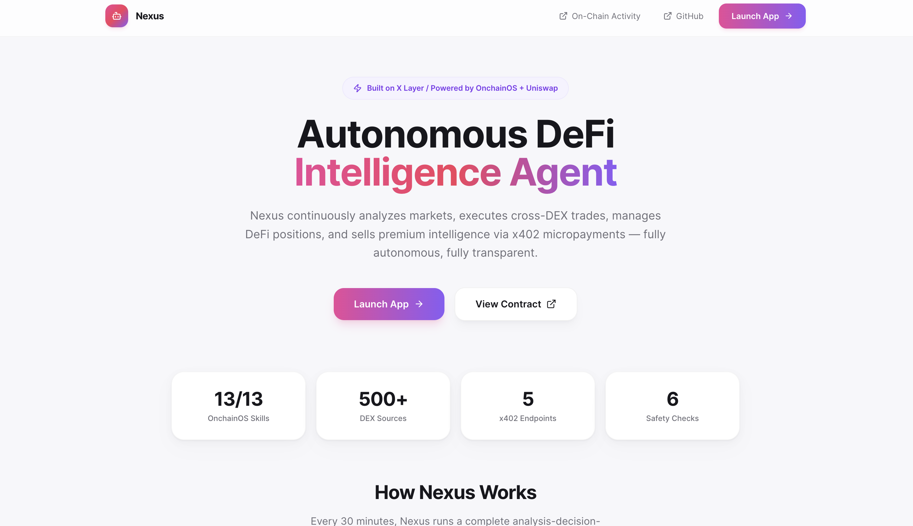
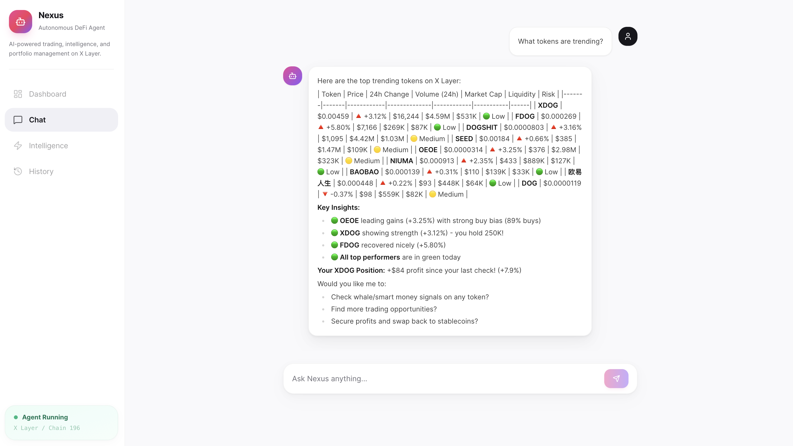
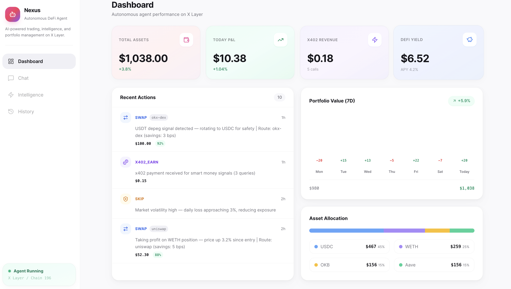
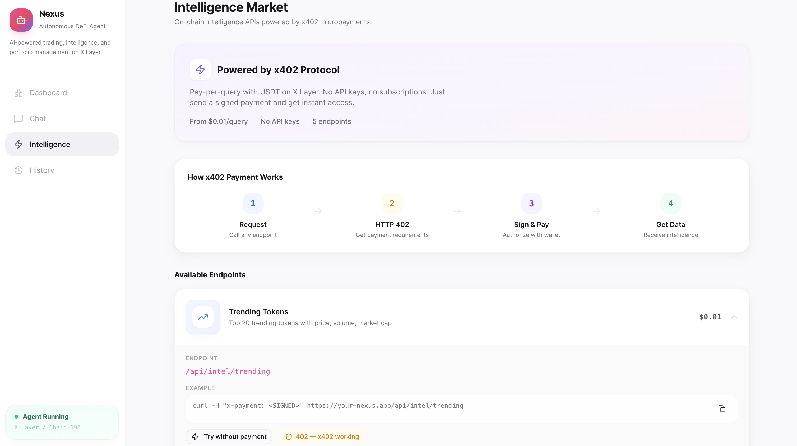
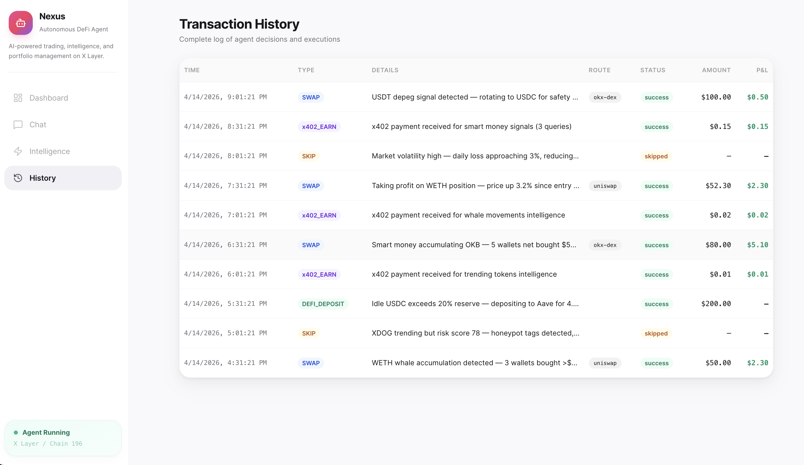

# Nexus - Autonomous On-Chain AI Intelligence Agent

> Build X Hackathon Season 2 | X Layer Arena

Nexus is an autonomous AI agent that operates a complete on-chain intelligence business on **X Layer**. It continuously analyzes market data, executes cross-DEX trades (OKX DEX + Uniswap), manages DeFi positions, and sells premium intelligence via **x402 micropayment APIs** -- forming a self-sustaining **earn -> pay -> re-earn** economic loop.

**Live App:** https://xlayer-two.vercel.app

**Demo Video:** https://youtu.be/LbPf5nxXXjw

**Verified On-Chain:**
- [NexusRegistry Contract](https://www.oklink.com/x-layer/address/0x3050BFe3a2fa1b4a8f47b1948DA7A0cB573e4B32) -- `0x3050BFe3a2fa1b4a8f47b1948DA7A0cB573e4B32`
- [Agent Wallet](https://www.oklink.com/x-layer/address/0x9279F67389f5Fa920741B58Ebd13f8eff587687b) -- `0x9279F67389f5Fa920741B58Ebd13f8eff587687b`



## Why Nexus

Traditional DeFi tools require users to manually monitor markets, compare prices across DEXes, assess token risks, and execute trades. Nexus automates this entire workflow with an AI agent that thinks, decides, and acts autonomously -- while giving users full transparency and control through a conversational interface.

### Key Features

**Autonomous Intelligence Engine**
- Runs a continuous SENSE -> THINK -> ACT -> REPORT cycle every 30 minutes
- Aggregates real-time data from whale trackers, smart money signals, trending tokens, and meme coin scanners
- AI (Claude) analyzes market conditions and produces structured trading decisions with confidence scores
- Every decision is logged with full reasoning -- no black box

**Cross-DEX Smart Routing**
- Every trade queries both **OKX DEX aggregator** (500+ liquidity sources) and **Uniswap** in parallel
- Automatically selects the route with the best output amount, lowest slippage, and optimal gas cost
- Typical savings: 5-15 basis points per trade vs single-DEX execution

**x402 Intelligence Marketplace**
- 5 paid API endpoints selling real-time on-chain intelligence via the x402 micropayment protocol
- Any agent or developer can access trending tokens, whale movements, smart money signals, token risk scores, and cross-DEX route comparisons
- Pay-per-query with USDT on X Layer -- no API keys, no subscriptions, no accounts needed
- Nexus also **consumes** x402 services from other agents, creating a bidirectional agent economy

**Built-in Safety Rails**
- Max 10% of portfolio per trade -- prevents oversized positions
- 20% stablecoin reserve floor -- always maintains liquidity buffer
- Confidence threshold (60%) -- only executes high-conviction trades
- Token risk scanner -- auto-rejects honeypots, rug pulls, and suspicious tokens (risk score > 70)
- Pre-execution simulation on every transaction
- Daily loss circuit breaker (5%) -- pauses trading when losses accumulate

**Conversational Control**
- Chat with the agent in natural language: "What's trending?", "Buy 50 USDC of WETH", "Is this token safe?"
- The agent uses 13 specialized tools (OKX OnchainOS + Uniswap) behind the scenes
- Every tool call is visible in the UI -- you see exactly what the agent is doing and why



**Full-Stack Web Dashboard**
- Real-time portfolio overview with P&L tracking
- 7-day performance chart with daily breakdown
- Asset allocation visualization
- Live action feed showing every agent decision with reasoning
- Transaction history with on-chain TX links
- Intelligence marketplace with API documentation



### Integration Depth

| Metric | Value |
|--------|-------|
| OnchainOS Skills used | **13 / 13** (100% coverage) |
| Uniswap Skills used | **3 / 3** core plugins |
| DEX sources compared | **500+** (OKX aggregator) + Uniswap |
| x402 endpoints | **5** paid + **1** consumer |
| Safety checks per trade | **6** independent rules |
| AI tools available | **13** Claude tool definitions |

## Architecture

```
User <-> [Web UI: Chat + Dashboard]
              |
         [AI Agent Core (Claude API + Tool Calling)]
         +--------+--------+-----------+
         |        |        |           |
         v        v        v           v
    Intelligence  Trading   DeFi     x402 Service
    Engine        Engine    Manager  Layer
         |        |        |           |
         +--------+--------+-----------+
              |
    [OnchainOS REST API + Uniswap Trading API]
              |
         [X Layer (Chain ID 196)]
         Agentic Wallet + NexusRegistry.sol
```

### Operating Modes

| Mode | Trigger | Description |
|------|---------|-------------|
| **Passive** | User chat | Natural language commands for trading, analysis, portfolio |
| **Autonomous** | Every 30 min | SENSE -> THINK -> ACT -> REPORT cycle |
| **Service** | HTTP request | x402 micropayment intelligence APIs |

### Tech Stack

Next.js 14 | TypeScript | Tailwind CSS + shadcn/ui | Claude API | SQLite + Drizzle ORM | viem | OKX OnchainOS API | Uniswap Trading API | x402 Protocol | Foundry (Solidity)

## Deployment

| Component | Address |
|-----------|---------|
| **NexusRegistry.sol** | [`0x3050BFe3a2fa1b4a8f47b1948DA7A0cB573e4B32`](https://www.oklink.com/x-layer/address/0x3050BFe3a2fa1b4a8f47b1948DA7A0cB573e4B32) (X Layer Mainnet, Chain 196) |
| **Agentic Wallet** | [`0x9279F67389f5Fa920741B58Ebd13f8eff587687b`](https://www.oklink.com/x-layer/address/0x9279F67389f5Fa920741B58Ebd13f8eff587687b) |

## OnchainOS Skill Usage (13/13)

| # | Skill | Usage in Nexus |
|---|-------|---------------|
| 1 | `okx-agentic-wallet` | Wallet lifecycle, balance queries, transaction signing |
| 2 | `okx-wallet-portfolio` | Portfolio valuation for dashboard and safety checks |
| 3 | `okx-security` | Token risk assessment, pre-trade security scanning (risk score 0-100) |
| 4 | `okx-dex-market` | Real-time pricing, candlestick data for market analysis |
| 5 | `okx-dex-signal` | Whale tracking, smart money signals, KOL monitoring |
| 6 | `okx-dex-trenches` | Meme token detection, dev reputation scoring, bundle detection |
| 7 | `okx-dex-swap` | Cross-DEX swap execution via 500+ DEX aggregation |
| 8 | `okx-dex-token` | Token discovery, trending tokens, holder analysis |
| 9 | `okx-onchain-gateway` | Gas estimation, transaction simulation, broadcasting |
| 10 | `okx-x402-payment` | x402 payment authorization for agent-as-consumer |
| 11 | `okx-defi-invest` | DeFi protocol deposits, withdrawals, reward claims |
| 12 | `okx-defi-portfolio` | Cross-protocol DeFi position monitoring |
| 13 | `okx-audit-log` | Audit trail export for transparency and compliance |

## Uniswap Skill Usage (3/3 core plugins)

| Skill | Usage in Nexus |
|-------|---------------|
| `swap-integration` | Execute swaps on Uniswap, compared with OKX DEX for best route |
| `pay-with-any-token` | x402 payments auto-swap any token to required payment token |
| `swap-planner` | Plan optimal routes, estimate prices, compare across DEXes |

## How It Works

### Autonomous Agent Loop (every 30 minutes)

```
PHASE 1: SENSE
  Fetch trending tokens, whale signals, smart money, portfolio state
  (okx-dex-token, okx-dex-signal, okx-wallet-portfolio, okx-defi-portfolio)

PHASE 2: THINK
  Claude AI analyzes all data -> structured action plan with confidence scores
  Each action includes: type, reason, confidence (0-1), token, amount

PHASE 3: ACT
  For each action:
  1. Security scan (okx-security) -> reject if risk > 70
  2. Cross-DEX route comparison: OKX DEX vs Uniswap -> pick best
  3. Transaction simulation (okx-onchain-gateway)
  4. Execute via winning route
  5. Log action on-chain (NexusRegistry.logAction)

PHASE 4: REPORT
  Record decisions -> update x402 API cache -> push to dashboard
```

### Cross-DEX Route Comparison

Every trade queries both **OKX DEX aggregator** (500+ liquidity sources) and **Uniswap Trading API** in parallel. The agent compares output amount, gas cost, and price impact, then selects the optimal route. This dual-DEX comparison happens on every single trade.

### x402 Intelligence Market

Nexus sells real-time on-chain intelligence via x402 micropayments -- no API keys, no subscriptions:

| Endpoint | Price | Data |
|----------|-------|------|
| `GET /api/intel/trending` | $0.01 | Top 20 trending tokens (price, volume, holders) |
| `GET /api/intel/whale-moves` | $0.02 | Whale transactions >$100K |
| `GET /api/intel/smart-money` | $0.05 | Smart money portfolio changes + top traders |
| `GET /api/intel/token-risk/:address` | $0.01 | Token security score + risk breakdown |
| `GET /api/intel/best-route?from=&to=&amount=` | $0.03 | Cross-DEX route comparison report |

Nexus also **consumes** x402 services (agent-as-consumer), creating bidirectional x402 usage.



### Economic Loop

```
EARN                              PAY
|- x402 intel API sales           |- Trading capital reinvestment
|- DeFi yield (Aave, etc.)       |- External x402 data purchases
|- Trading profits
         |                              |
         v                              v
    AI Capital Allocation --> Better decisions --> More earnings
```

### Safety Rails

| Rule | Threshold |
|------|-----------|
| Max trade size | 10% of portfolio per trade |
| Reserve floor | Always keep 20% in stablecoins |
| Confidence threshold | Skip if < 60% |
| Token risk cap | Reject if risk score > 70 |
| Pre-execution simulation | Every trade simulated first |
| Daily loss limit | Pause if daily loss > 5% |

## Smart Contract

**NexusRegistry.sol** deployed on X Layer provides:
- On-chain agent identity and configuration
- Immutable action log (SWAP, DEFI, SKIP, x402_EARN events)
- Risk parameters stored on-chain for accountability
- 10/10 Foundry tests passing

## MCP Integration

Nexus integrates with OnchainOS via MCP (Model Context Protocol), enabling any AI editor or agent framework to interact with the full Nexus + OnchainOS stack.

### Setup MCP Server

```bash
# Install OnchainOS MCP server
claude mcp add --scope user onchainos-cli onchainos mcp

# Or via npx
npx skills add okx/onchainos-skills
```

### MCP Configuration (claude_desktop_config.json)

```json
{
  "mcpServers": {
    "onchainos": {
      "command": "onchainos",
      "args": ["mcp"],
      "env": {
        "OKX_API_KEY": "your-api-key",
        "OKX_SECRET_KEY": "your-secret-key",
        "OKX_PASSPHRASE": "your-passphrase",
        "OKX_PROJECT_ID": "your-project-id"
      }
    }
  }
}
```

This exposes all 13 OnchainOS skills (wallet, swap, market, signal, security, DeFi, x402, audit) as MCP tools that any compatible AI agent can call directly.

## Setup

```bash
npm install
cp .env.example .env  # Fill in API keys
npx drizzle-kit push
npm run dev
```

### Deploy Smart Contract

```bash
cd contracts
forge build
forge create --rpc-url https://rpc.xlayer.tech \
  --private-key $AGENT_PRIVATE_KEY \
  src/NexusRegistry.sol:NexusRegistry \
  --constructor-args $AGENT_WALLET_ADDRESS
```

### Run Tests

```bash
npx vitest run          # Safety rail tests (9/9)
cd contracts && forge test -v  # Contract tests (10/10)
```

## Frontend

| Page | Description |
|------|-------------|
| **Dashboard** (`/`) | Portfolio stats, P&L, x402 revenue, DeFi yield, live action feed |
| **Chat** (`/chat`) | Natural language interaction with streaming responses and tool calls |
| **Intelligence** (`/intel`) | x402 API marketplace with docs, curl examples, live try-it |
| **History** (`/history`) | Full transaction log with reasoning, routes, and on-chain TX links |



## X Layer Ecosystem Position

Nexus demonstrates the full power of the X Layer ecosystem:

- **Zero-gas Agentic Wallet** operations for high-frequency autonomous trading
- **13/13 OnchainOS skill coverage** -- the most comprehensive integration possible
- **Cross-DEX intelligence** comparing OKX DEX (500+ DEXes) and Uniswap on X Layer
- **x402 data marketplace** creating a new revenue model for AI agents on X Layer
- **Real transaction volume** driving X Layer adoption through autonomous agent activity
- **On-chain transparency** via NexusRegistry contract with full audit trail

## Team

Solo developer

## License

MIT
